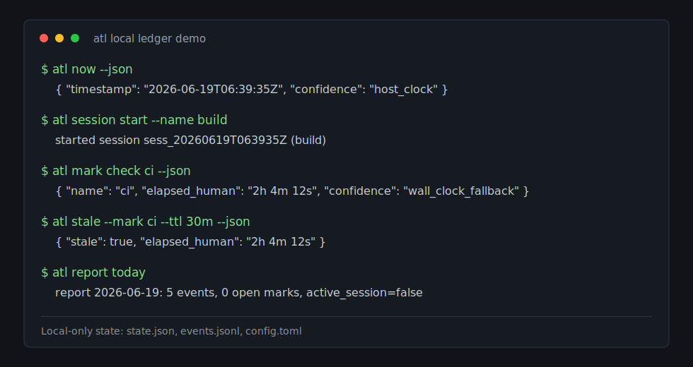
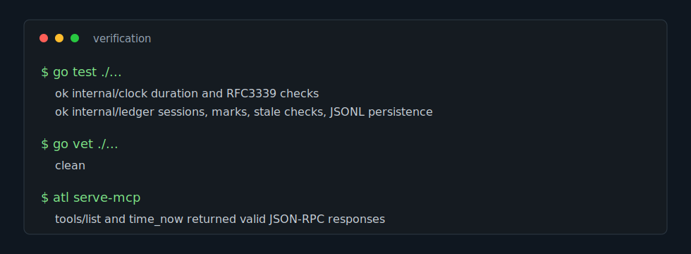

# agent-time-ledger

[](https://github.com/ZionBoggan/agent-time-ledger/actions/workflows/test.yml)



`agent-time-ledger` is a small local-first tool that helps LLM agents stop guessing how much time has passed.

Basic current-time tools already exist. The useful gap is elapsed time: an agent may say "10 minutes passed" because the conversation looks short, even when 2 hours actually passed while commands, CI jobs, renders, or external services were running. `atl` measures from the runtime clock and stores local marks, sessions, stale checks, and reports.

The binary name is `atl`.

## Scope

- One local CLI binary.
- No cloud service.
- No telemetry.
- No prompt capture.
- No SaaS dashboard.
- No token or cost tracking.
- No natural-language date parsing.
- No general observability platform.

State is stored under `~/.agent-time-ledger` by default:

- `state.json`
- `events.jsonl`
- `config.toml`

For tests or isolated runs, set `ATL_HOME=/path/to/dir`.

## Install

```bash
go install github.com/zionboggan/agent-time-ledger/cmd/atl@latest
```

From a local checkout:

```bash
go build -o atl ./cmd/atl
```

## CLI

```bash
atl now
atl now --json
atl now --tz America/Chicago --json

atl session start --name build
atl session status
atl session status --json
atl session end

atl mark start ci
atl mark check ci
atl mark check ci --json
atl mark list
atl mark delete ci

atl stale --timestamp 2026-06-19T06:30:00Z --ttl 30m
atl stale --timestamp 2026-06-19T06:30:00Z --ttl 30m --json
atl stale --mark ci --ttl 2h

atl report today
atl report --json

atl serve-mcp
```

`atl now` returns both a timezone-aware timestamp and a UTC timestamp. By default it uses the host timezone, or `ATL_TIMEZONE` if set. Pass `--tz <iana-timezone>` for an explicit zone such as `America/Chicago`, `America/New_York`, or `UTC`.

JSON responses include a `confidence` value. For v0.1, persisted elapsed calculations use wall-clock timestamps, so elapsed responses report `wall_clock_fallback`. Current host time reports `host_clock`.

## MCP Tools

`atl serve-mcp` runs a stdio MCP server exposing local-only tools:

- `time_now`
- `session_status`
- `mark_start`
- `mark_elapsed`
- `mark_list`
- `mark_delete`
- `stale_check`
- `ledger_event`
- `ledger_report`

The `time_now` MCP tool accepts an optional `timezone` argument. The MCP server only reads and writes local `atl` state. It does not run shell commands, read arbitrary files, access the network, or sync to a cloud service.

## Verification



Tests and repeatable checks are documented in [docs/verification.md](docs/verification.md). Pull requests run `go test ./...` and `go vet ./...` in GitHub Actions.

## Agent Rule Block

```text
Use agent-time-ledger tools for time-sensitive claims.

Do not estimate elapsed time from conversation text.
Before saying how long something took, call session_status or mark_elapsed.
Before answering what time it is for a person, call time_now with their IANA timezone when known.
Before relying on previous external observations, call stale_check.
When starting a long-running task, call mark_start with a descriptive name.
```
